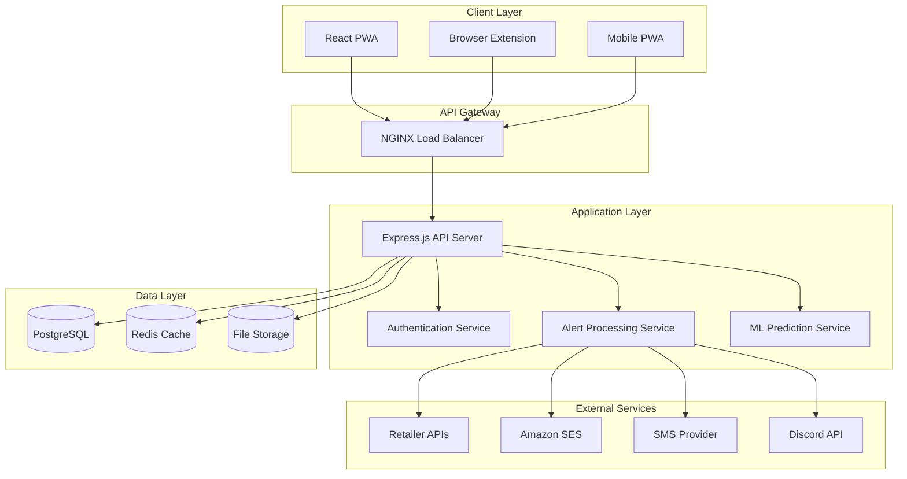

# Design Document

## Overview

BoosterBeacon is a collector-grade alerting service built as a modern, scalable web application that monitors Pokémon TCG product availability across major retailers and delivers real-time alerts to collectors. The system is designed with a microservices-oriented architecture that prioritizes performance, compliance, and user experience.

The application consists of three main components:
1. **Backend API** - Node.js/Express server handling business logic, data management, and external integrations
2. **Frontend Web Application** - React-based PWA providing user interfaces and real-time notifications
3. **Browser Extension** - Chrome/Firefox extension for automated checkout assistance

## Architecture

### High-Level Architecture



### Technology Stack

**Backend:**
- **Runtime**: Node.js 18+ with TypeScript
- **Framework**: Express.js with Helmet.js security middleware
- **Database**: PostgreSQL 15+ for primary data storage
- **Cache**: Redis for session management and real-time data
- **Authentication**: JWT tokens with bcrypt password hashing
- **File Storage**: AWS S3 or compatible for user uploads and static assets
- **Process Management**: PM2 for production deployment

**Frontend:**
- **Framework**: React 18+ with TypeScript
- **Build Tool**: Vite for fast development and optimized builds
- **UI Library**: Tailwind CSS with custom Pokémon-themed components
- **State Management**: React Context API with useReducer for complex state
- **PWA Features**: Service Worker for offline capability and push notifications
- **Real-time**: WebSocket connection for live alerts

**Browser Extension:**
- **Framework**: Vanilla TypeScript with Web Extensions API
- **Build**: Webpack for cross-browser compatibility
- **Storage**: Chrome/Firefox extension storage APIs
- **Communication**: Message passing with content scripts

**Infrastructure:**
- **Containerization**: Docker with multi-stage builds
- **Reverse Proxy**: NGINX for load balancing and SSL termination
- **Monitoring**: Winston logging with structured JSON output
- **Deployment**: Docker Compose for development, systemd for production

## Components and Interfaces

### Core Services

#### 1. Authentication Service
**Purpose**: Manages user registration, login, session management, and authorization

**Key Methods:**
```typescript
interface AuthService {
  register(userData: UserRegistration): Promise<User>
  login(credentials: LoginCredentials): Promise<AuthToken>
  validateToken(token: string): Promise<User>
  refreshToken(refreshToken: string): Promise<AuthToken>
  resetPassword(email: string): Promise<void>
  updatePassword(userId: string, newPassword: string): Promise<void>
}
```

**Security Features:**
- Password hashing with bcrypt (12 rounds)
- JWT tokens with 15-minute access token expiry
- Refresh tokens with 7-day expiry
- Rate limiting on authentication endpoints
- Account lockout after failed attempts

#### 2. Product Monitoring Service
**Purpose**: Monitors retailer APIs and websites for product availability changes

**Key Methods:**
```typescript
interface MonitoringService {
  addProductWatch(userId: string, productId: string, filters: WatchFilters): Promise<Watch>
  removeProductWatch(watchId: string): Promise<void>
  checkAvailability(productId: string, retailerId: string): Promise<AvailabilityStatus>
  scheduleMonitoring(productId: string, interval: number): Promise<void>
  getWatchStatus(watchId: string): Promise<WatchStatus>
}
```

**Monitoring Strategy:**
- Official APIs prioritized (Best Buy, Walmart affiliate)
- Polite web scraping for monitor-only retailers (Costco, Sam's Club)
- Configurable check intervals (30s-5min based on product popularity)
- Circuit breaker pattern for failed retailer connections
- Respect robots.txt and rate limiting

#### 3. Alert Delivery Service
**Purpose**: Processes and delivers alerts through multiple channels

**Key Methods:**
```typescript
interface AlertService {
  sendAlert(alert: Alert, user: User, channels: NotificationChannel[]): Promise<DeliveryResult>
  scheduleAlert(alert: Alert, deliveryTime: Date): Promise<void>
  trackDelivery(alertId: string): Promise<DeliveryStatus>
  respectQuietHours(userId: string, alert: Alert): Promise<boolean>
  deduplicateAlerts(alerts: Alert[]): Promise<Alert[]>
}
```

**Delivery Channels:**
- Web Push: Primary channel with service worker integration
- Email: Amazon SES with HTML templates
- SMS: Twilio integration for Pro users
- Discord: Webhook integration for community alerts

#### 4. Machine Learning Service
**Purpose**: Provides predictive analytics and market insights

**Key Methods:**
```typescript
interface MLService {
  predictPrice(productId: string, timeframe: number): Promise<PricePrediction>
  calculateSelloutRisk(productId: string): Promise<RiskScore>
  estimateROI(productId: string, currentPrice: number): Promise<ROIEstimate>
  trainModel(modelType: string, trainingData: any[]): Promise<ModelMetrics>
  getMarketInsights(productId: string): Promise<MarketInsights>
}
```

**ML Features:**
- Price prediction using historical data and market trends
- Sell-out risk assessment based on availability patterns
- ROI estimation for collectible items
- Seasonal trend analysis
- Hype meter calculation from user engagement

### Data Models

#### User Model
```typescript
interface User {
  id: string
  email: string
  passwordHash: string
  subscriptionTier: 'free' | 'pro'
  profile: UserProfile
  preferences: UserPreferences
  createdAt: Date
  updatedAt: Date
}

interface UserProfile {
  firstName?: string
  lastName?: string
  shippingAddresses: Address[]
  paymentMethods: PaymentMethod[]
  retailerCredentials: RetailerCredential[]
}

interface UserPreferences {
  notificationChannels: NotificationChannel[]
  quietHours: QuietHours
  alertFilters: AlertFilters
  locationSettings: LocationSettings
}
```

#### Product Model
```typescript
interface Product {
  id: string
  name: string
  sku: string
  upc: string
  category: ProductCategory
  set: string
  releaseDate: Date
  msrp: number
  imageUrl: string
  metadata: ProductMetadata
}

interface ProductAvailability {
  productId: string
  retailerId: string
  inStock: boolean
  price: number
  url: string
  cartUrl?: string
  lastChecked: Date
  storeLocations?: StoreLocation[]
}
```

#### Alert Model
```typescript
interface Alert {
  id: string
  userId: string
  productId: string
  retailerId: string
  type: AlertType
  priority: AlertPriority
  data: AlertData
  createdAt: Date
  deliveredAt?: Date
  status: AlertStatus
}

interface AlertData {
  productName: string
  retailerName: string
  price: number
  originalPrice?: number
  availability: 'in_stock' | 'low_stock' | 'pre_order'
  cartUrl?: string
  productUrl: string
  expiresAt?: Date
}
```

### API Endpoints

#### Authentication Endpoints
```
POST /api/auth/register
POST /api/auth/login
POST /api/auth/refresh
POST /api/auth/logout
POST /api/auth/forgot-password
POST /api/auth/reset-password
```

#### User Management Endpoints
```
GET /api/users/profile
PUT /api/users/profile
GET /api/users/preferences
PUT /api/users/preferences
POST /api/users/addresses
PUT /api/users/addresses/:id
DELETE /api/users/addresses/:id
```

#### Product and Watch Endpoints
```
GET /api/products
GET /api/products/:id
GET /api/products/search
POST /api/watches
GET /api/watches
PUT /api/watches/:id
DELETE /api/watches/:id
GET /api/watches/:id/status
```

#### Alert Endpoints
```
GET /api/alerts
GET /api/alerts/:id
PUT /api/alerts/:id/read
DELETE /api/alerts/:id
GET /api/alerts/history
```

#### Admin Endpoints
```
GET /api/admin/users
PUT /api/admin/users/:id
DELETE /api/admin/users/:id
POST /api/admin/ml/train
GET /api/admin/system/health
GET /api/admin/analytics
```

## Error Handling

### Error Response Format
```typescript
interface ErrorResponse {
  error: {
    code: string
    message: string
    details?: any
    timestamp: string
    requestId: string
  }
}
```

### Error Categories

**Authentication Errors (401)**
- Invalid credentials
- Expired tokens
- Account locked
- Email not verified

**Authorization Errors (403)**
- Insufficient permissions
- Subscription tier limitations
- Feature not available

**Validation Errors (400)**
- Invalid input data
- Missing required fields
- Format violations
- Business rule violations

**Rate Limiting Errors (429)**
- Too many requests
- API quota exceeded
- Temporary throttling

**External Service Errors (502/503)**
- Retailer API failures
- Email delivery failures
- SMS service unavailable
- Database connection issues

### Error Recovery Strategies

**Retry Logic:**
- Exponential backoff for transient failures
- Circuit breaker for external services
- Dead letter queues for failed alerts

**Graceful Degradation:**
- Fallback to cached data when APIs fail
- Basic heuristics when ML service unavailable
- Email fallback when push notifications fail

**User Communication:**
- Clear error messages in user interface
- System status page for service outages
- Proactive notifications for account issues

## Testing Strategy

### Unit Testing
- **Framework**: Jest with TypeScript support
- **Coverage Target**: 90% code coverage
- **Focus Areas**: Business logic, data validation, utility functions
- **Mocking**: External services, database connections, third-party APIs

### Integration Testing
- **Framework**: Supertest for API testing
- **Database**: Test database with Docker containers
- **External Services**: Mock servers for retailer APIs
- **Authentication**: Test JWT token generation and validation

### End-to-End Testing
- **Framework**: Playwright for browser automation
- **Scenarios**: User registration, product watching, alert delivery
- **Cross-browser**: Chrome, Firefox, Safari testing
- **Mobile**: PWA functionality on mobile devices

### Performance Testing
- **Load Testing**: Artillery.js for API endpoint testing
- **Stress Testing**: Database connection pooling under load
- **Monitoring**: Response time tracking and alerting
- **Optimization**: Query performance and caching effectiveness

### Security Testing
- **Authentication**: Token security and session management
- **Authorization**: Role-based access control
- **Input Validation**: SQL injection and XSS prevention
- **Rate Limiting**: API abuse prevention
- **Credential Storage**: Encryption and secure storage

## Deployment Architecture

### Development Environment
```yaml
# docker-compose.dev.yml
version: '3.8'
services:
  app:
    build: .
    ports:
      - "3000:3000"
    environment:
      - NODE_ENV=development
      - DATABASE_URL=postgresql://user:pass@db:5432/boosterbeacon_dev
    volumes:
      - .:/app
      - /app/node_modules
    depends_on:
      - db
      - redis

  db:
    image: postgres:15
    environment:
      POSTGRES_DB: boosterbeacon_dev
      POSTGRES_USER: user
      POSTGRES_PASSWORD: pass
    volumes:
      - postgres_data:/var/lib/postgresql/data

  redis:
    image: redis:7-alpine
    ports:
      - "6379:6379"
```

### Production Environment
```yaml
# docker-compose.prod.yml
version: '3.8'
services:
  nginx:
    image: nginx:alpine
    ports:
      - "80:80"
      - "443:443"
    volumes:
      - ./nginx.conf:/etc/nginx/nginx.conf
      - ./ssl:/etc/ssl
    depends_on:
      - app

  app:
    build:
      context: .
      dockerfile: Dockerfile.prod
    environment:
      - NODE_ENV=production
      - DATABASE_URL=${DATABASE_URL}
      - REDIS_URL=${REDIS_URL}
    deploy:
      replicas: 2
    depends_on:
      - db
      - redis

  db:
    image: postgres:15
    environment:
      POSTGRES_DB: ${POSTGRES_DB}
      POSTGRES_USER: ${POSTGRES_USER}
      POSTGRES_PASSWORD: ${POSTGRES_PASSWORD}
    volumes:
      - postgres_data:/var/lib/postgresql/data
      - ./backups:/backups

  redis:
    image: redis:7-alpine
    command: redis-server --appendonly yes
    volumes:
      - redis_data:/data
```

### Repository and Version Control
- **GitHub Repository**: https://github.com/curtesyflush1/booster
- **Branching Strategy**: GitFlow with main, develop, and feature branches
- **Commit Standards**: Conventional commits for automated changelog generation
- **Code Review**: Pull request reviews required before merging to main

### Deployment Pipeline
1. **Code Push**: Developer pushes to main branch
2. **CI/CD Trigger**: GitHub Actions workflow starts
3. **Testing**: Run unit, integration, and security tests
4. **Build**: Create optimized Docker images
5. **Deploy to Staging**: Automated deployment to staging environment
6. **Smoke Tests**: Basic functionality verification
7. **Production Deploy**: Manual approval for production deployment
8. **Health Checks**: Verify all services are running correctly
9. **Rollback Plan**: Automated rollback if health checks fail

### Monitoring and Observability
- **Application Metrics**: Response times, error rates, throughput
- **Infrastructure Metrics**: CPU, memory, disk usage, network
- **Business Metrics**: Alert delivery rates, user engagement, conversion
- **Logging**: Structured JSON logs with correlation IDs
- **Alerting**: PagerDuty integration for critical issues
- **Dashboards**: Grafana dashboards for real-time monitoring